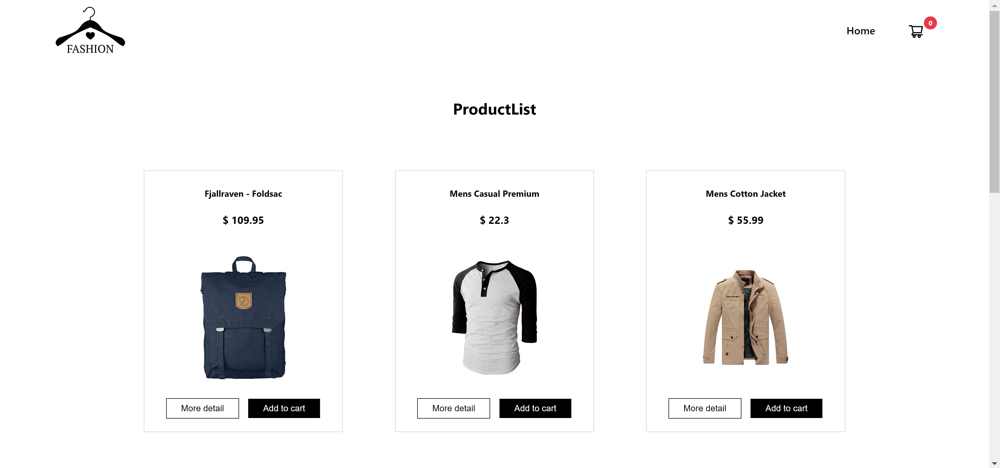
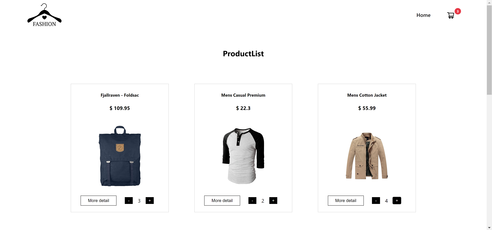
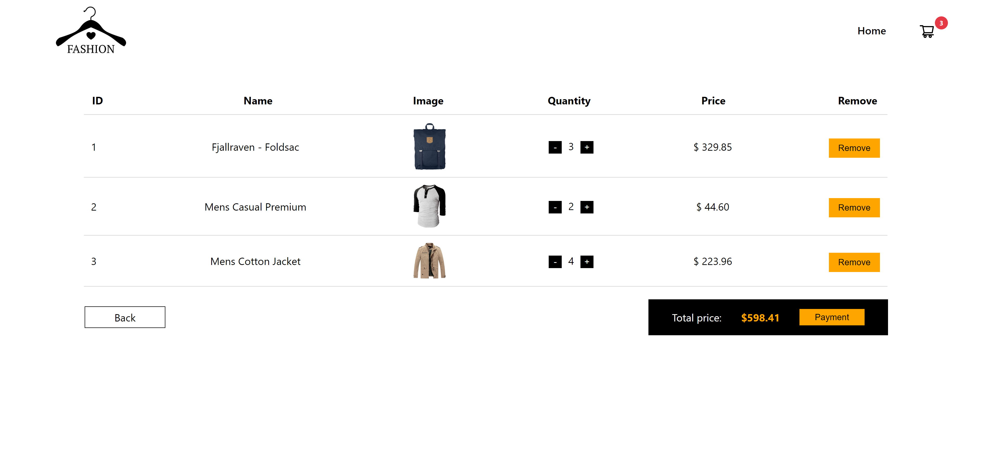
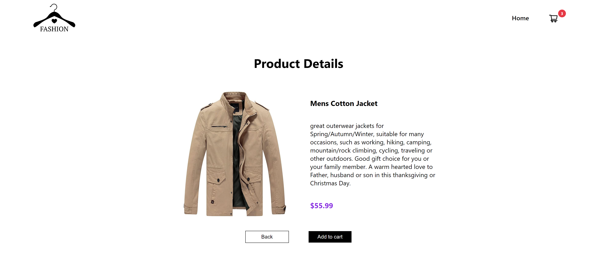

# React assignment

This assignment is to practice React : passing props, React hook: useState, useEffect and React router

## How to run project

1. Step 1: yarn
2. Step 2: yarn start

## Screenshots

